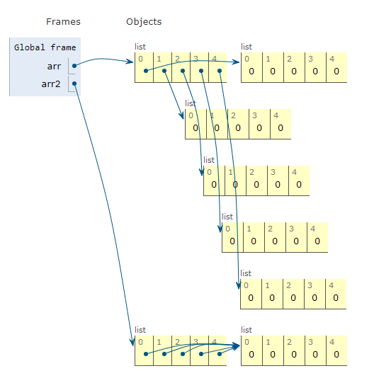

## 570. 배열2 - 자가진단7

[문제 링크](http://www.jungol.co.kr/bbs/board.php?bo_table=pbank&wr_id=207&sca=10a0)

1회독: 20.12.22


### my solution

```python
arr = [[0] * 5 for _ in range(5)]

# 1. 첫 행 & 첫 열 1로 만들어주기
for i in range(len(arr)):
    arr[0][i] = 1
    arr[i][0] = 1


# 2. 왼쪽 + 위쪽 => 현재 위치 값
for j in range(1, 5):
    for k in range(1, 5):
        arr[j][k] = arr[j-1][k] + arr[j][k-1]

for idx in range(len(arr)):
    print(*arr[idx])
```


### 참고

```python
# 1.
arr = [[0] * 5] * 5

# 2.
arr = [[0] * 5 for _ in range(5)]
```

위 두 코드는 5 x 5 배열을 만드는 코드로 원소는 0을 가진다. 

만든 뒤의 모습은 동일하게 나오게 되서 헷갈렸던 부분인데 

1번처럼 배열을 만들게 되면 가리키는 메모리 주소가 동일하기 때문에 

원소를 조작했을 때 원하는 모습이 나오지 않는다.



arr2의 경우 1번 코드로 작성해서 인덱스가 가리키는 0의 주소가 동일하기 때문에 모든 값이 변경되고

2번 코드로 작성해야지만 참조하는 주소의 위치가 변하기 때문에 알맞게 작업을 수행하게 된다.


### 태그

- 배열


