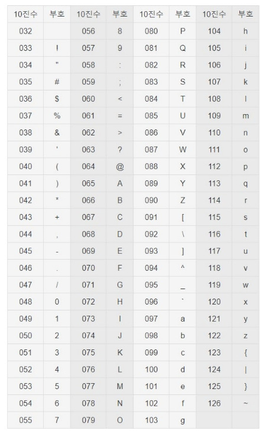

## 593. 문자열1 - 자가진단1

[문제 링크](http://www.jungol.co.kr/bbs/board.php?bo_table=pbank&wr_id=230&sca=10e0)

1회독: 21.06.10


### my solution

```python
# 1. input
while True:
    N = int(input('ASCII code =? '))
    if 33 <= N <= 127:
        print(chr(N))
    else:
        break
```

(1) 해당 조건이 맞을 때는 input을 계속 반복 

(2) ascii 코드로 변환

### 참고 자료

##### ASCII

> 미국 정보교환 표준 부호, American Standard Code for Information Interchange 영문 알파벳을 사용하는 대표적인 문자 인코딩

- 0 ~ 32: 제어용 언어(역사적으로 남아있고 지금은 사용 X)
- 52개의 영문 알파벳 대소문자, 10개 숫자, 32개의 특수문자, 1개의 공백문자



[출처: 나무위키](https://namu.wiki/w/%EC%95%84%EC%8A%A4%ED%82%A4%20%EC%BD%94%EB%93%9C)

##### ord()

> 문자열을 아스키코드로

##### chr()

> 아스키코드를 문자열로


### 태그

- ASCII
- 문자열